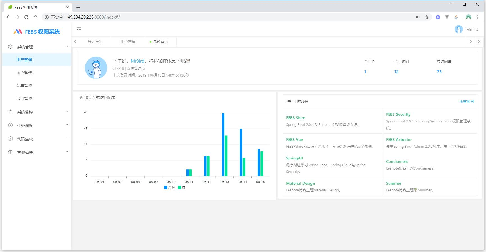
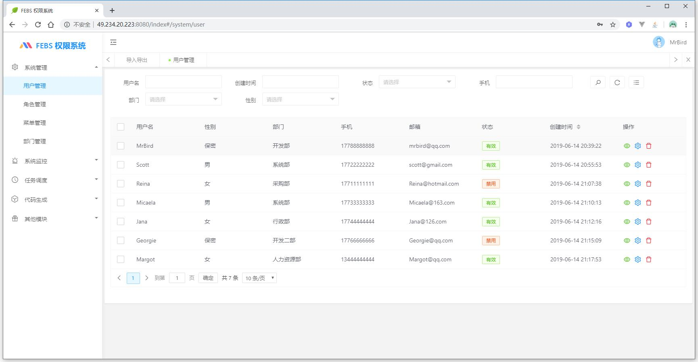
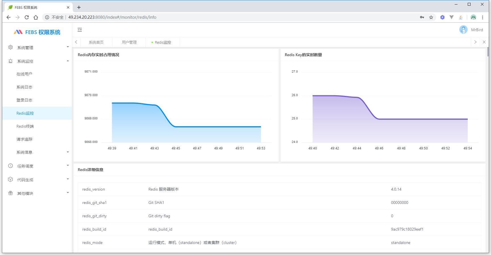
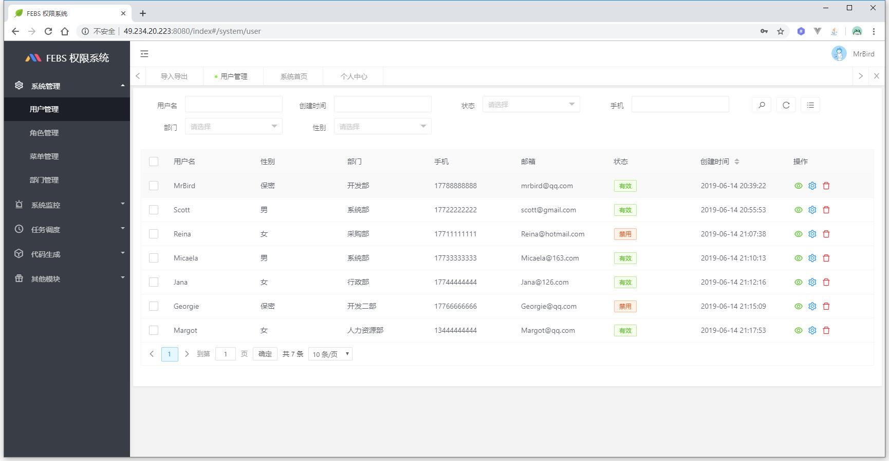
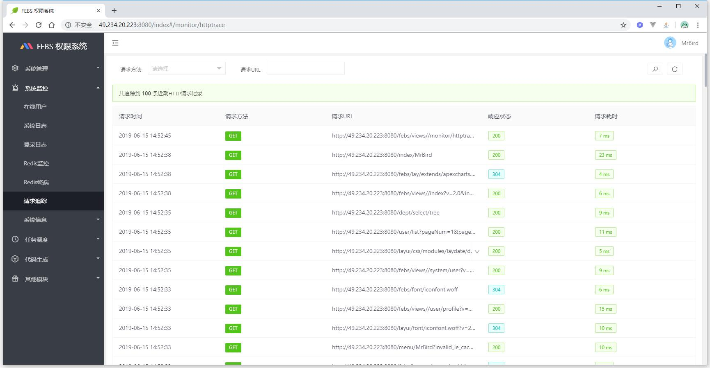
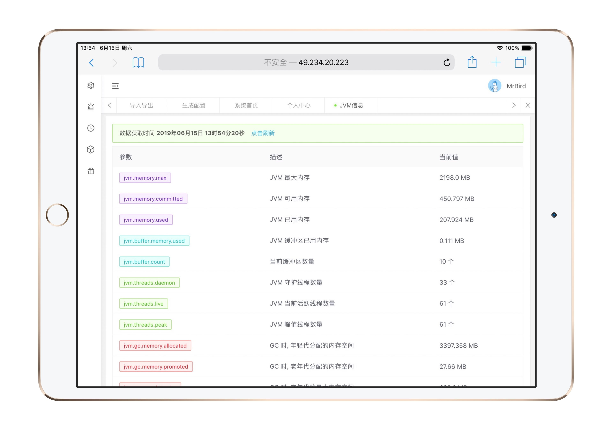

### 编辑器记得安装lombok插件

### FEBS-Shiro 2.0


FEBS-Shiro是一款简单高效的后台权限管理系统，使用Spring Boot，Shiro和Layui构建。FEBS意指：**F**ast，**E**asy use，**B**eautiful和**S**afe。相信无论作为企业级应用，私活开发脚手架或者权限系统构建学习，FEBS-Shiro都会是一个不错的选择。

### 演示地址

[https://shiro.mrbird.cn:8080](https://shiro.mrbird.cn:8080)

演示环境账号密码：

账号 | 密码| 权限
---|---|---
scott | 1234qwer | 注册账户，拥有查看，新增权限（新增用户除外）和导出Excel权限


本地部署账号密码：

账号 | 密码| 权限
---|---|---
mrbird | 1234qwer |超级管理员，拥有所有增删改查权限
scott | 1234qwer | 注册账户，拥有查看，新增权限（新增用户除外）和导出Excel权限
micaela | 1234qwer |系统监测员，负责整个系统监控模块
Jana   | 1234qwer  |跑批人员，负责任务调度跑批模块

### 更多版本
当前分支为2.0版本，页面采用Layui全新构建，FEBS的其他版本：

名称 | 描述| 地址
---|---|---
FEBS-Shiro 1.x | Spring Boot 2.0.4 & Shiro1.4.2 权限管理系统（单页）。 | [https://github.com/wuyouzhuguli/FEBS-Shiro/tree/mysql](https://github.com/wuyouzhuguli/FEBS-Shiro/tree/mysql)
FEBS-Security | Spring Boot 2.0.4 & Spring Security 5.0.7 权限管理系统（单页）。 | [https://github.com/wuyouzhuguli/FEBS-Security](https://github.com/wuyouzhuguli/FEBS-Security)
FEBS-Vue | FEBS-Shiro前后端分离版本，前端架构采用Vue全家桶。 | [https://github.com/wuyouzhuguli/FEBS-Vue](https://github.com/wuyouzhuguli/FEBS-Vue)
FEBS-Cloud | 基于Spring Cloud的微服务权限系统 | [https://github.com/wuyouzhuguli/FEBS-Cloud](https://github.com/wuyouzhuguli/FEBS-Cloud)

### 系统模块
系统功能模块组成如下所示：
```
├─系统管理
│  ├─用户管理
│  ├─角色管理
│  ├─菜单管理
│  └─部门管理
├─系统监控
│  ├─在线用户
│  ├─系统日志
│  ├─登录日志
│  ├─请求追踪
│  ├─系统信息
│  │  ├─JVM信息
│  │  ├─TOMCAT信息
│  │  └─服务器信息
├─任务调度
│  ├─定时任务
│  └─调度日志
├─代码生成
│  ├─生成配置
│  ├─代码生成
└─其他模块
   ├─FEBS组件
   │  ├─表单组件
   │  ├─表单组合
   │  ├─FEBS工具
   │  ├─系统图标
   │  └─其他组件
   ├─APEX图表
   ├─高德地图
   └─导入导出
```
### 系统特点

1. 前后端请求参数校验

2. 支持Excel导入导出

3. 前端页面布局多样化，主题多样化

4. 支持多数据源，代码生成

5. 多Tab页面，适合企业应用

6. 用户权限动态刷新

7. 浏览器兼容性好，页面支持PC，Pad和移动端。

8. 代码简单，结构清晰

### 技术选型

#### 后端
- [Spring Boot 2.2.1](http://spring.io/projects/spring-boot/)
- [Mybatis-Plus](https://mp.baomidou.com/guide/)
- [MySQL 5.7.x](https://dev.mysql.com/downloads/mysql/5.7.html#downloads),[Hikari](https://brettwooldridge.github.io/HikariCP/),[Redis](https://redis.io/)
- [Shiro 1.4.2](http://shiro.apache.org/)

#### 前端
- [Layui 2.5.5](https://www.layui.com/)
- [Nepadmin](https://gitee.com/june000/nep-admin)
- [formSelects 4.x 多选框](https://hnzzmsf.github.io/example/example_v4.html)
- [eleTree 树组件](https://layuiextend.hsianglee.cn/eletree/)
- [formSelect.js树形下拉](https://wujiawei0926.gitee.io/treeselect/docs/doc.html)
- [Apexcharts图表](https://apexcharts.com/)

### 系统截图

#### PC端







#### 手机


#### Pad



### 浏览器兼容
|[](http://godban.github.io/browsers-support-badges/)</br>IE| [](http://godban.github.io/browsers-support-badges/)</br>Edge | [](http://godban.github.io/browsers-support-badges/)</br>Firefox | [](http://godban.github.io/browsers-support-badges/)</br>Chrome | [](http://godban.github.io/browsers-support-badges/)</br>Safari |[](http://godban.github.io/browsers-support-badges/)</br>Opera
| --------- | --------- | --------- | --------- | --------- |--------- |
|IE 10+| Edge| last 15 versions| last 15 versions| last 10 versions| last 15 versions
